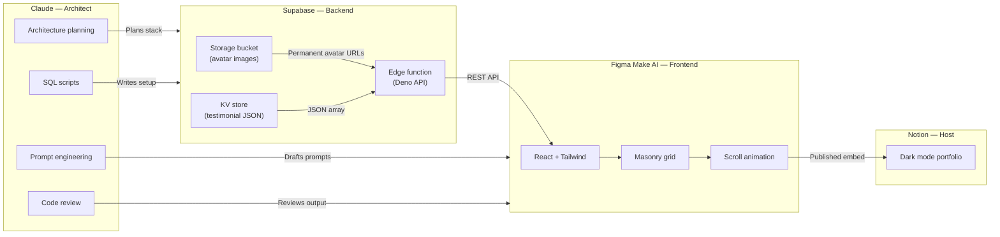

# Wall of Love

A responsive, animated testimonial masonry wall — built entirely with AI tools. No manual coding. Replaces a $360/year SaaS subscription with a self-hosted, data-driven component that embeds seamlessly into a dark mode Notion portfolio.

**[Live demo](https://peanut-lung-27249983.figma.site)** · **[See it in context on my portfolio](NOTION_PORTFOLIO_URL)**

``

---

## Why I built this

I used a Testimonial SaaS for years to display colleague feedback on my portfolio. It worked, but three things bothered me:

- **$30+/month** for what amounts to a grid of cards with a scroll animation
- **Limited design control** — couldn't match it precisely to a dark mode Notion page
- **Vendor lock-in** — my testimonial content and avatar images lived on their Firebase storage. Cancel the subscription, lose the data.

I wanted full ownership of my social proof, zero recurring cost, and a pixel-perfect dark mode embed. I also wanted to prove that a Product Manager with the right AI tools can ship a production-quality component without writing code from scratch.

## The result

| Metric | Value |
|---|---|
| SaaS cost eliminated | ~$360/year |
| Build time | 4 hours, single day |
| Manual code written | 0 lines (all AI-generated, human-reviewed) |
| Testimonials migrated | 15, zero data loss |
| Ongoing cost | $0 (free tiers) |

---

## Tech stack

| Layer | Tool | Role |
|---|---|---|
| Frontend | Figma Make AI | React + Tailwind CSS generation from natural language prompts |
| Backend | Supabase | Postgres database (KV store), Edge Functions (Deno API), file storage |
| Architecture | Claude | System design, SQL scripts, prompt engineering, code review, data migration |
| Host | Notion | Dark mode portfolio page, `/embed` integration |

### Architecture



---

## Features

- **Masonry layout** — Pinterest-style staggered grid with variable card heights based on content length
- **Animated scroll** — Columns drift vertically at a constant 30px/sec. Alternating directions (up, down, up, down). Hover pauses all columns at once.
- **Responsive** — 5 columns on wide screens down to 1 column on mobile. Column count adapts via `ResizeObserver` with a formula-based breakpoint: `cols = min(5, max(1, floor((width - 20) / 400)))`
- **Seamless loop** — Card stack is duplicated; CSS `translateY` animates to -50% then resets. Duration is calculated dynamically from content height so scroll speed stays consistent regardless of card count.
- **Gradient fade masks** — 60px overlays at top and bottom fade from `#191919` to transparent, creating the illusion of infinite content
- **Dark mode native** — Background matches Notion dark mode (`#191919`) exactly. Cards use `#1E1E1E` with a solid `#FFA500` offset shadow and left border accent.
- **Data-driven** — Testimonials load from a Supabase KV store via an Edge Function REST API. No hardcoded content.
- **Fallback avatars** — When no profile image exists, a lettered avatar renders with `#5D5DFF` background and white initials

---

## Project structure

```
wall-of-love/
├── src/
│   ├── app/
│   │   ├── App.tsx                  # Main component — columns, scroll, responsive logic
│   │   ├── components/
│   │   │   └── TestimonialCard.tsx   # Card component — avatar, stars, text, truncation
│   │   └── data/
│   │       └── seed.json            # Seed data for initial database population
│   └── styles/
│       ├── fonts.css                # Open Sans import
│       ├── index.css                # Tailwind base
│       ├── tailwind.css             # Tailwind config + source paths
│       └── theme.css                # Light/dark mode CSS variables
├── supabase/
│   └── functions/
│       └── server/
│           ├── index.tsx            # Hono API routes (GET/POST /testimonials)
│           └── kv_store.tsx         # KV store interface (get, set, del, mset, mget)
├── utils/
│   └── supabase/
│       └── info.tsx                 # Supabase project ID + public anon key
├── package.json
└── README.md
```

---

## How it was built

This project was built entirely through AI-assisted development:

1. **Architecture planning** — Claude mapped the system design, identified the tech stack, and planned the component decomposition into four focused build steps (card → column → grid → polish)
2. **UI generation** — Figma Make AI generated the React + Tailwind frontend from structured natural language prompts. Each prompt built on the previous output.
3. **Backend setup** — Claude wrote the Supabase SQL scripts, storage bucket policies, and data migration from the previous Testimonial SaaS CSV export
4. **Iteration** — Visual comparison against the original SaaS output drove refinement prompts for shadow style, card spacing, responsive behaviour, and scroll speed
5. **Security review** — Claude audited the codebase for secrets exposure, confirmed the anon key is safe for client-side use, verified `SERVICE_ROLE_KEY` stays server-side, and checked RLS policies

The full build log with actual prompts used is documented in the [companion case study](https://www.darpan.io/built-a-testimonial-wall-of-love-with-ai?utm_source=github&utm_medium=link&utm_content=readme).

---

## Built by

**Darpan Dadhaniya** — Product Leader, 10+ years in B2B/B2C SaaS

[LinkedIn](https://www.linkedin.com/in/darpan-dadhaniya/) · [Product Thinking](https://www.darpan.io/samples?utm_source=github&utm_medium=link&utm_content=readme) ·  [Product Thinking](https://www.darpan.io/samples?utm_source=github&utm_medium=link&utm_content=readme)

---

## License

MIT
